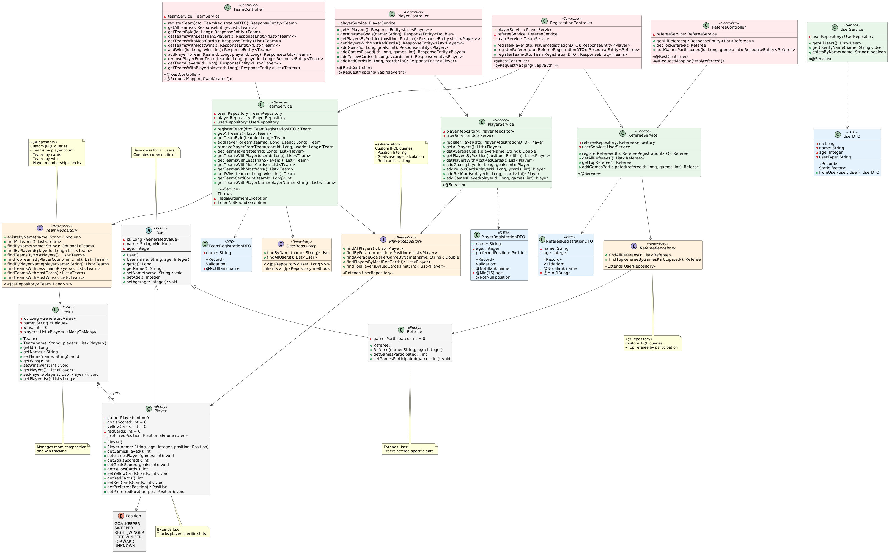

# SoccerNow ⚽

A full-stack application for managing players, teams, referees, matches, and competitions.  
Developed as a **university project** (**FCUL**), focusing on clean architecture, layered design, and multi-platform interaction.

The project delivers:
- A **Spring Boot backend** providing a REST API for data management.  
- A **JavaFX desktop client** and a **Thymeleaf-based web interface** for user interaction.  

My primary contributions centered on the **frontend** — designing and implementing the JavaFX UI and the Thymeleaf web interface (layouts, controllers, styling, navigation). I also contributed to backend integration and endpoints, working in collaboration with my teammate, who primarily led the backend.

---

## 🚀 Project Overview

SoccerNow is composed of three main parts:

- **Backend (Java, Spring Boot, PostgreSQL)**  
  REST API for managing players, teams, matches, and competitions.  
  Uses Spring Data JPA, DTOs, layered architecture, and global exception handling.

- **Web Interface (Thymeleaf, CSS)**  
  Provides a browser-based UI to interact with backend data.  
  Built with reusable templates and entity-specific pages (`player.html`, `team.html`, etc.).

- **Desktop Interface (JavaFX, FXML)**  
  A native client for local data interaction.  
  Includes modular navigation, dedicated controllers, and automatic filtering in tables.

---

## ✨ Features

- Manage **players, teams, referees, matches, and competitions**  
- Multi-platform interaction: **JavaFX desktop client** + **Thymeleaf web UI**  
- REST API with **Spring Boot & PostgreSQL** backend  
- Dockerized setup for easy local deployment  
- MVC + DAO + DTO patterns with layered architecture  
- Global exception handling & DTO-based data transfer  

---

## 🛠️ Tech Stack

- **Backend:** Java 17, Spring Boot, Spring Data JPA, PostgreSQL  
- **Frontend (Web):** Thymeleaf, HTML, CSS  
- **Frontend (Desktop):** JavaFX, FXML  
- **Design Patterns:** MVC, DAO, DTO, Dependency Injection, Singleton, Global Exception Handling  
- **DevOps:** Docker Compose (for local setup)  

---

## 📂 Repository Structure

- [`SoccerNow/`](SoccerNow) → Backend (Spring Boot + Thymeleaf Web UI)  
- [`SoccerNowFX/`](SoccerNowFX) → Native Desktop UI (JavaFX) 

To run with Docker:  
```bash
docker compose up --build
```

(Note: the helper script run.sh may not work; use the command directly.)

---

## 🎥 Demonstration

Due to file size, the demo video is hosted externally:

📺 [`Google Drive Link`](https://drive.google.com/drive/folders/1B3QNkfvwYntC-L4pLZPXGabDsFOWM0fE?usp=sharing)

---

## 📊 Architecture Diagram

The following UML class diagram shows the main entities, repositories, services, and controllers in the backend:



---

## 👥 Credits & Attribution

Developed by: Francisco Carvalho (fc52838) and Martim Neto (fc56279)

- **Francisco Carvalho (me):** Primary focus on the **frontend** (JavaFX + Thymeleaf Web UI), including reusable layouts, controllers, modular navigation, and styling. Also contributed to backend endpoints and integration.
- **Martim Neto:** Primary focus on the **backend** (Spring Boot API + data layer), including domain modeling, JPA repositories, DTOs, and error handling. Also contributed to frontend integration.

Some commits appear under university IDs due to GitLab classroom setup (e.g., fc56279@…).

---

## 📄 Report

For full technical details, see the project report:

[`RelatorioCss.pdf`](RelatorioCss.pdf)

---

## 📜 License
This project is provided for **portfolio and demonstration purposes**.  

You are welcome to clone, run, and test it, but **commercial or professional use is not authorized** without explicit permission.  

© All rights reserved to the developers.
